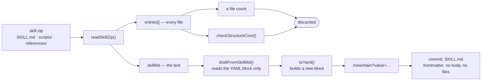
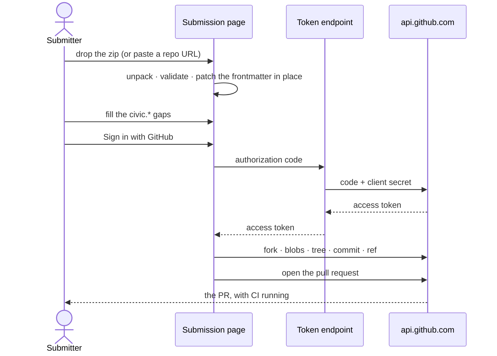
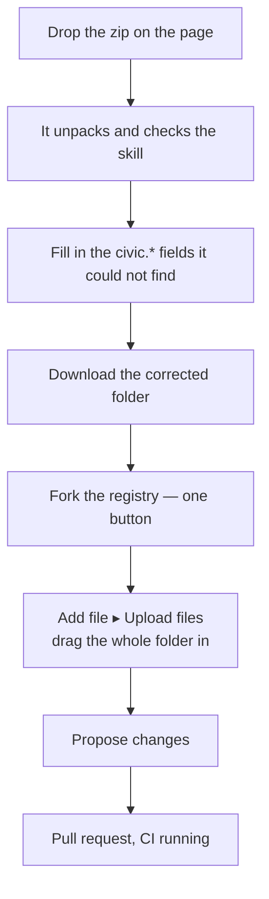

# Submitting a skill that is more than one file

Status: analysis, ends in decision questions. Issues:
[#70](https://github.com/AI-Lab-for-Cities-at-Harvard/civic-skill-exchange/issues/70)
(the defect and the manual path),
[#71](https://github.com/AI-Lab-for-Cities-at-Harvard/civic-skill-exchange/issues/71)
(sign-in), which is blocked on questions 2 and 3 below.

## What is wrong now

A submitter uploads a zip. The page unpacks it correctly, reports the right file
count, runs the right structural checks — and then commits a `SKILL.md`
containing nothing but regenerated frontmatter. The body is gone. `scripts/`
and `references/` are gone.

Nothing is broken in the reader. The loss is downstream of it, and it is total:

`site/src/components/Submit.tsx:249` keeps `entries` only long enough to count
it. `site/src/lib/parse.ts:20` reads the frontmatter and returns a `Draft`, so
everything after the closing `---` is dropped at that line. `toYaml()` then
emits a block built from form fields rather than the submitter's own file, and
that string is the entire `value=` prefill GitHub receives.

The repository-import path (`onImport`) has the identical defect: it fetches
every entry and drops them the same way.

## This question was raised and never ruled on

[#24](https://github.com/AI-Lab-for-Cities-at-Harvard/civic-skill-exchange/issues/24)
listed it as research problem 3 — *"single-field submission does not fit real
skills"* — with four options and a note that each had a real cost. The rulings
that followed settled the hand-off target, the two flows, the validation posture
and the URL budget. They did not settle this one. The zip reader was then built
as an **input** and the output side was never closed.

The same comment states the principle the build should have followed:

> take their existing `SKILL.md` and have the tool write the `civic.*` block
> into it, preserving whatever is already there. The submitter should never be
> editing frontmatter by hand to satisfy us.

That is the correction. The page should **patch the submitter's file**, not
author a replacement for it.

## What was measured

| Question | Answer | How |
|---|---|---|
| Can the browser call the GitHub API directly? | Yes. `api.github.com` returns `access-control-allow-origin: *` | probe |
| Can the browser exchange an OAuth code for a token? | **No.** `github.com/login/*` returns no `access-control-allow-origin` at all, on the preflight or the POST | probe |
| Does GitHub's upload page take a folder? | Yes — the docs say "drag and drop the file **or folder**", and subdirectories are preserved | GitHub docs |
| Does GitHub auto-fork for someone without write access? | Documented for **editing a file**. Not documented for **uploading** | GitHub docs |
| Would PKCE remove the need for a secret, and so for the endpoint? | **No, twice over.** GitHub has supported PKCE since July 2025, but does not distinguish public from confidential clients: the secret stays mandatory outside the device flow. And the CORS wall stands regardless of how the code was obtained | GitHub changelog and OAuth best-practices docs |
| Can Actions or Pages host the endpoint? | No. Actions jobs are ephemeral with no inbound socket; Pages executes nothing at request time. `repository_dispatch` looks like an endpoint but needs a privileged token and cannot return a response | GitHub docs |

PKCE should be adopted anyway. It costs a verifier and a challenge in the page,
and it stops a stolen authorization code being redeemed by someone else through
an endpoint that is necessarily public. `state` likewise, against CSRF on the
callback.

Two consequences. First, a token endpoint is unavoidable for OAuth, but it is
the *only* thing that needs a server: it swaps `code` for `access_token` and
nothing else. It never sees a skill, stores nothing, and holds one secret.
Everything else — fork, blobs, tree, commit, ref, pull request — runs in the
page against an API that already allows it.

Second, the manual path forks first rather than trusting an undocumented
auto-fork on upload.

## Two paths, one pull request

Both end in a pull request authored by the submitter, on a branch, validated by
the same CI. That is not a nicety: `validator/src/rules.ts:225` checks namespace
ownership against the **pull request author**, so a commit made on the
submitter's behalf by the project would fail the check it exists to enforce.
Whatever the page does, the submitter has to be the committer.

### Path A — connected

Three steps for the submitter. Requires the token endpoint.

### Path B — manual

No account beyond GitHub, no backend, nothing lost. Costs one download and one
drag.

The page opens the fork and the upload page at the right path, so the submitter
never types a path.

## What the page is for

Once the file is patched rather than regenerated, most of the form has no job.
The submitter's `SKILL.md` already carries `name`, `description`, `license` and
`allowed-tools`. Re-asking for them is the redundancy — and re-emitting them is
how the content got lost.

So the form collapses to **the gaps**: the `civic.*` fields the registry needs
and a skill written elsewhere will not have. Fields already present are shown
settled, not as inputs. This is also the answer to #24's research problem 1,
which was that the form is too long.

The from-scratch flow is unchanged and already correct — one file, nothing to
lose, and `value=` prefill works.

## Decision questions

**1. Build both paths, manual first?**
Recommend yes. Path B needs no infrastructure and unblocks submissions now;
Path A is a convenience upgrade over the same machinery, since both need the
patched folder in memory and neither changes what CI sees.

**2. Where does the token endpoint live?**
Owner's call — it is the project's first server-side component, and
`ARCHITECTURE.md` currently opens by saying there is no server, so whatever is
chosen needs an ADR rather than a quiet drift.

All the candidates are about forty lines and free at this volume. What separates
them is not capability:

- **Cloudflare Worker.** The only one whose *default* posture is CI-driven: a
  Worker has no repo-watching build system unless one is opted into, so
  `wrangler-action` from a workflow satisfies "deploys are CI-only" without
  anything to keep disabled. Lightest, and thrown away if the project later
  needs a datastore.
- **Netlify / Vercel function.** Both can be deployed from Actions, contrary to
  a first impression — but their onboarding wires their own git integration to
  the repository, which must then be actively switched off to keep one pipeline.
  Vercel's Hobby tier is also contractually non-commercial, so an institutional
  endpoint means the paid tier.
- **AWS — API Gateway, Lambda, Parameter Store, CDK, OIDC from Actions.**
  Heaviest for forty lines, and the only one that is also a home for the
  datastore #48 will need. Worth taking now only if the destination is AWS
  anyway; otherwise it is two platforms where one would do.

Whichever is chosen becomes a client secret *and* a deploy credential to rotate,
plus a thing that can be down — so Path B has to keep working when it is.

**3. OAuth App or GitHub App?**
Recommend an OAuth App with `public_repo`, **registered under the organization**.
A GitHub App's user token reaches only repositories the app is installed on, so
each submitter would have to install it on their own fork before it could push.

Registering under the org is not merely tidy. If OAuth app access restrictions
are ever switched on, an unapproved app loses privileged actions on org
resources — which would break pull request creation — while apps owned by the
organization are granted access automatically.

The disclosure cost is real and should be said plainly on the page: `public_repo`
grants write access to **all** of the submitter's public repositories, not only
the fork. There is no narrower classic scope. For an audience of public-sector
staff, some will decline, and Path B is what they use.

Unverified: whether Harvard's enterprise account layers app policies above the
organization. Worth asking whoever administers it before this is built.

**4. What does Path B hand back — the whole folder, or just the amended file?**
Recommend the whole folder as a zip. Handing back a single `SKILL.md` is lighter
for someone who still has the folder on disk, but it does not work for a
repository import, and it asks the submitter to find and replace a file. One
uniform answer beats two conditional ones.

**5. Do the diagrams ship to submitters, or only live here?**
Recommend both. The flow above is what someone needs on the page while they are
doing it, not only in a design document — each path shown as numbered steps with
the current one marked.

## Hardening the API sequence, if Path A is built

Verified against GitHub's documentation, and each one is a way the obvious
implementation breaks.

- **Forking is asynchronous.** `POST /repos/{owner}/{repo}/forks` returns 202,
  and the docs say you may have to wait before the git objects are reachable.
  Poll `GET /repos/{user}/{fork}/git/ref/heads/main` until it answers rather
  than trusting the 202.
- **The fork may already exist.** A repeat submission gets a 202 carrying the
  existing fork, but that behaviour is undocumented — verify by reading the
  repository back and checking its `parent`. A stale fork is brought forward
  with `POST /repos/{owner}/{repo}/merge-upstream`, whose 409 on conflict should
  reach the submitter rather than being force-pushed over.
- **Do not create a blob per file.** `POST /git/trees` takes inline `content`
  per entry against a `base_tree`, which collapses a submission to about five
  writes. This matters: the binding limit is not the 5,000/hour primary one but
  the secondary content-creation limit of 80 requests a minute and 500 an hour,
  which a blob-per-file loop on a large skill can graze. Inline content is
  text-only, so a skill carrying an image still needs a base64 blob for it.
- **The token lives in memory.** OAuth App tokens do not expire. It should never
  reach `localStorage`, and never be sent anywhere but `api.github.com`.
- **The endpoint forwards `code` and `code_verifier`, and nothing else.** It must
  never accept a caller-supplied `client_id`. Checking `Origin` and rate
  limiting are worth having, though the exchange is inherently public.
- **`redirect_uri` is on the Pages origin, not the function's.** GitHub redirects
  the *browser* back with the code; the page then posts it to the function,
  which never appears in the redirect. Matching is exact, and a project site on
  Pages serves no rewrites — so the registered callback has to be a path that
  actually resolves there.
