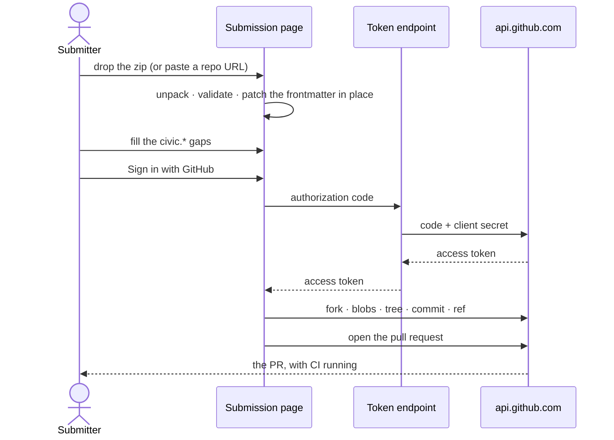
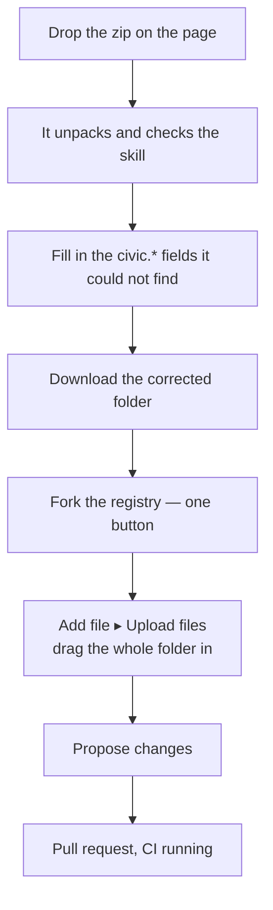

# Submitting a skill that is more than one file

Status: analysis, ends in decision questions. Issues:
[#70](https://github.com/AI-Lab-for-Cities-at-Harvard/civic-skill-exchange/issues/70)
(the defect and the manual path),
[#71](https://github.com/AI-Lab-for-Cities-at-Harvard/civic-skill-exchange/issues/71)
(sign-in), which is blocked on questions 2 and 3 below.

## What is wrong now

A submitter uploads a zip. The page unpacks it correctly, reports the right file
count, runs the right structural checks — and then commits a `SKILL.md`
containing nothing but regenerated frontmatter. The body is gone. `scripts/`
and `references/` are gone.

Nothing is broken in the reader. The loss is downstream of it, and it is total:

`site/src/components/Submit.tsx:249` keeps `entries` only long enough to count
it. `site/src/lib/parse.ts:20` reads the frontmatter and returns a `Draft`, so
everything after the closing `---` is dropped at that line. `toYaml()` then
emits a block built from form fields rather than the submitter's own file, and
that string is the entire `value=` prefill GitHub receives.

The repository-import path (`onImport`) has the identical defect: it fetches
every entry and drops them the same way.

## This question was raised and never ruled on

[#24](https://github.com/AI-Lab-for-Cities-at-Harvard/civic-skill-exchange/issues/24)
listed it as research problem 3 — *"single-field submission does not fit real
skills"* — with four options and a note that each had a real cost. The rulings
that followed settled the hand-off target, the two flows, the validation posture
and the URL budget. They did not settle this one. The zip reader was then built
as an **input** and the output side was never closed.

The same comment states the principle the build should have followed:

> take their existing `SKILL.md` and have the tool write the `civic.*` block
> into it, preserving whatever is already there. The submitter should never be
> editing frontmatter by hand to satisfy us.

That is the correction. The page should **patch the submitter's file**, not
author a replacement for it.

## What was measured

| Question | Answer | How |
|---|---|---|
| Can the browser call the GitHub API directly? | Yes. `api.github.com` returns `access-control-allow-origin: *` | probe |
| Can the browser exchange an OAuth code for a token? | **No.** `github.com/login/*` returns no `access-control-allow-origin` at all, on the preflight or the POST | probe |
| Does GitHub's upload page take a folder? | Yes — the docs say "drag and drop the file **or folder**", and subdirectories are preserved | GitHub docs |
| Does GitHub auto-fork for someone without write access? | Documented for **editing a file**. Not documented for **uploading** | GitHub docs |

Two consequences. First, a token endpoint is unavoidable for OAuth, but it is
the *only* thing that needs a server: it swaps `code` for `access_token` and
nothing else. It never sees a skill, stores nothing, and holds one secret.
Everything else — fork, blobs, tree, commit, ref, pull request — runs in the
page against an API that already allows it.

Second, the manual path forks first rather than trusting an undocumented
auto-fork on upload.

## Two paths, one pull request

Both end in a pull request authored by the submitter, on a branch, validated by
the same CI. That is not a nicety: `validator/src/rules.ts:225` checks namespace
ownership against the **pull request author**, so a commit made on the
submitter's behalf by the project would fail the check it exists to enforce.
Whatever the page does, the submitter has to be the committer.

### Path A — connected

Three steps for the submitter. Requires the token endpoint.

### Path B — manual

No account beyond GitHub, no backend, nothing lost. Costs one download and one
drag.

The page opens the fork and the upload page at the right path, so the submitter
never types a path.

## What the page is for

Once the file is patched rather than regenerated, most of the form has no job.
The submitter's `SKILL.md` already carries `name`, `description`, `license` and
`allowed-tools`. Re-asking for them is the redundancy — and re-emitting them is
how the content got lost.

So the form collapses to **the gaps**: the `civic.*` fields the registry needs
and a skill written elsewhere will not have. Fields already present are shown
settled, not as inputs. This is also the answer to #24's research problem 1,
which was that the form is too long.

The from-scratch flow is unchanged and already correct — one file, nothing to
lose, and `value=` prefill works.

## Decision questions

**1. Build both paths, manual first?**
Recommend yes. Path B needs no infrastructure and unblocks submissions now;
Path A is a convenience upgrade over the same machinery, since both need the
patched folder in memory and neither changes what CI sees.

**2. Where does the token endpoint live?**
Owner's call — it is the project's first server-side component. A Cloudflare
Worker or a Netlify/Vercel function are each about forty lines. Whichever is
chosen becomes a secret to rotate and a thing that can be down, and Path B has
to keep working when it is.

**3. OAuth App or GitHub App?**
Recommend an OAuth App with `public_repo`. A GitHub App would have to be
installed on each submitter's fork before it could push, which is a worse first
run for the audience this is for.

**4. What does Path B hand back — the whole folder, or just the amended file?**
Recommend the whole folder as a zip. Handing back a single `SKILL.md` is lighter
for someone who still has the folder on disk, but it does not work for a
repository import, and it asks the submitter to find and replace a file. One
uniform answer beats two conditional ones.

**5. Do the diagrams ship to submitters, or only live here?**
Recommend both. The flow above is what someone needs on the page while they are
doing it, not only in a design document — each path shown as numbered steps with
the current one marked.
